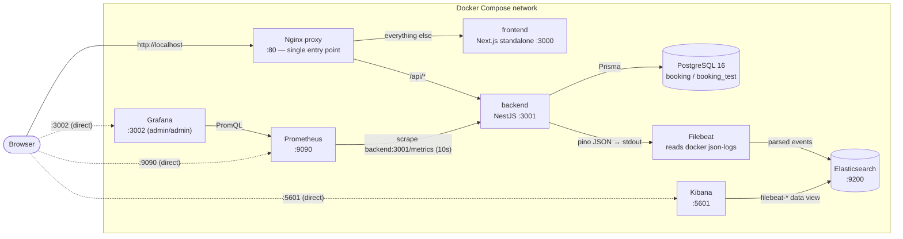
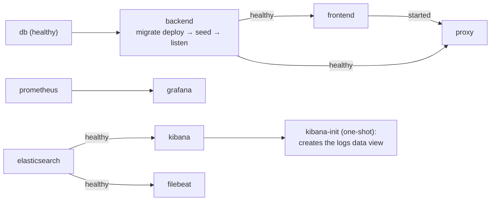

# Meeting Room Booking

A meeting-room booking web application for an office: employees open a room's
week schedule, see occupied slots, book free time with a titled meeting and
cancel their own bookings; the "My bookings" page lists upcoming and past
bookings. Other people's bookings cannot be modified or cancelled. The office
time zone is **Europe/Kyiv**; working hours are defined and validated against it,
but every time in the UI is rendered in the visitor's **own browser time zone**
(a 10:00 Kyiv slot shows as 09:00 for a Berlin visitor). Times are stored in UTC
in the database.

## Stack

| Layer | Technology |
| --- | --- |
| Monorepo | Nx (integrated), TypeScript `strict` everywhere, no `any` |
| Frontend | Next.js 16 (App Router), React 19, Tailwind CSS, shadcn/ui, lucide-react, sonner, next-themes, TanStack Query |
| Backend | NestJS 11 (Fastify adapter), class-validator DTOs, Swagger, JWT auth, @nestjs/throttler |
| Database | PostgreSQL 16 + Prisma (SQL migrations, `btree_gist` EXCLUDE constraint) |
| Proxy | Nginx — the single entry point (`:80`) |
| Monitoring | Prometheus + Grafana (pre-provisioned dashboard), prom-client via @willsoto/nestjs-prometheus |
| Logging | Structured JSON logs via nestjs-pino → ELK: Filebeat → Elasticsearch → Kibana (auto-provisioned data view) |
| Tests | Vitest (+ SWC for Nest decorators), supertest integration tests |
| Infra | Docker + Docker Compose, multi-stage builds |

## Workspace structure

```
apps/
  backend/         NestJS REST API (+ prisma schema, migrations, seed, Dockerfile)
  frontend/        Next.js app (App Router, shadcn/ui, Dockerfile)
libs/
  shared/          Shared types, API DTO contracts and domain constants
infra/
  nginx/           Reverse-proxy config (single entry point)
  prometheus/      Scrape config
  grafana/         Datasource + dashboard provisioning, dashboard JSON
  elk/             Filebeat config + Kibana data-view provisioning script
  db/              init script creating the booking_test database
docker-compose.yml
```

Per-app docs: [`apps/backend/README.md`](apps/backend/README.md) ·
[`apps/frontend/README.md`](apps/frontend/README.md)

## Architecture (Docker)



The backend and frontend ports are **not** published to the host — all
application traffic goes through the proxy. Prometheus and Grafana publish
their own ports directly, bypassing Nginx. `GET /health` and `GET /metrics`
are served without the `/api` prefix and without JWT.

Startup order is enforced by health-gated `depends_on`:



## Running

### 1. Fully in Docker (production-like)

```bash
docker compose up --build
```

That's it. On a fresh clone this brings up:

- **App:** http://localhost (via Nginx)
- **Swagger:** http://localhost/api/docs
- **Prometheus:** http://localhost:9090
- **Grafana:** http://localhost:3002 — login `admin` / `admin`, the
  **"Meeting Room Booking — API"** dashboard is pre-provisioned and shows data
  immediately (RPS, p95/p50 latency, 4xx/5xx rate, created/cancelled bookings,
  409 conflicts).
- **Kibana (logs):** http://localhost:5601 — no login; open **Discover**, the
  **"Application logs"** data view (`filebeat-*`) is pre-provisioned and set
  as default. Backend pino logs arrive parsed (`req.url`, `res.statusCode`,
  `responseTime`, `msg`, ...); nginx/postgres/etc. logs arrive as plain
  messages. Elasticsearch itself is at http://localhost:9200.

The backend container applies Prisma migrations (`migrate deploy`) and the
idempotent demo seed on every start.

### 2. Dev mode (hot reload)

```bash
npm install                 # install deps (postinstall generates the Prisma client)
cp .env.example .env        # defaults work out of the box
docker compose up -d db     # Postgres only (also creates booking_test)
npm run prisma:migrate      # apply migrations to the dev database
npm run seed                # rooms, two test users and demo bookings
npx nx serve backend        # http://localhost:3001/api, Swagger at /api/docs
npx nx serve frontend       # http://localhost:3000
```

(The Docker path in §1 does `migrate deploy` + seed automatically on backend
start; in dev mode you run them once yourself, as above.)

In dev mode the frontend talks directly to `http://localhost:3001/api`
(`NEXT_PUBLIC_API_URL`), which is why CORS is enabled outside production.

### Tests & quality gates

```bash
npm test                             # unit tests, all projects (alias for `nx run-many -t test`)
npx nx run-many -t lint,test,build   # lint (Biome) + unit tests + builds, all projects
npm run lint                         # Biome check (lint + format) across the whole repo
npm run format                       # Biome: auto-fix lint + format files in place
npm run test:integration             # supertest API tests (needs `docker compose up -d db`)
npm run test:e2e                      # Playwright browser e2e (needs the app stack up on :80)
```

Integration tests run against the separate `booking_test` database (created
automatically by `infra/db/init-test-db.sql`) and apply migrations before the
suite. The Playwright e2e suite (`e2e/`, config in `playwright.config.ts`) drives
the real app in a browser and expects the full stack reachable at `E2E_BASE_URL`
(default `http://localhost`); bring it up with
`docker compose up -d --wait db backend frontend proxy`.

### Git hooks (local, fast)

Hooks live in `.githooks/` and are activated automatically by the `prepare`
script on `npm install` (`git config core.hooksPath .githooks`). They finish in
seconds and only do fast, staged-file work — everything heavier is left to CI:

- **pre-commit** — Biome format + safe lint fixes on staged files (auto-fixed and
  re-staged), a trailing-whitespace / conflict-marker check (`git diff --check`),
  and a staged-only secret scan with
  [gitleaks](https://github.com/gitleaks/gitleaks) when installed
  (`brew install gitleaks`; skipped with a note otherwise).
- **commit-msg** — validates the subject against Conventional Commits via
  `scripts/lint-commit-msg.sh` (the same script CI uses).

Bypass in a pinch with `git commit --no-verify` — CI re-runs every one of these
checks (below), so nothing slips through.

### CI (GitHub Actions)

`.github/workflows/ci.yml` runs on every push to `main` and every pull request.
The fast fallback gates run first and in parallel; the expensive jobs are chained
behind them (`lint` → `unit` → `integration` → `e2e`) so a cheap failure stops
the run before it spends minutes downstream. Every local hook check is duplicated
here, so a `--no-verify` commit is still caught.

- **Lint (Biome)** — `nx run-many -t lint` (fallback for the pre-commit Biome step).
- **Secrets (gitleaks)** — scans the push/PR range (fallback for the pre-commit scan).
- **Commit messages** — validates every commit subject in the PR with
  `scripts/lint-commit-msg.sh` (fallback for the commit-msg hook).
- **Build** — `nx run-many -t build` (backend + frontend).
- **Unit tests** — `nx run-many -t test`; coverage is collected (v8) and uploaded
  as an artifact.
- **SAST (CodeQL)** — static analysis for JavaScript/TypeScript.
- **Integration** — `test:integration` against a Postgres service seeded with the
  `booking_test` database.
- **E2E** — builds and boots the Docker stack (`db`, `backend`, `frontend`,
  `proxy`), then runs Playwright against the Nginx proxy; the HTML report is
  uploaded as a build artifact.

Dynamic analysis (**DAST**) is intentionally kept off the per-PR pipeline:
`.github/workflows/dast.yml` runs an OWASP ZAP baseline scan against the full
Docker stack nightly (and on demand via *Run workflow*).

## Test accounts (seed)

| Email | Password |
| --- | --- |
| `test1@office.dev` | `password123` |
| `test2@office.dev` | `password123` |

Seeded rooms (name · floor · capacity): **Small** (1 · 4), **Large** (1 · 12),
**Skype booth** (2 · 1), **Brainstorm** (2 · 6), **Boardroom** (3 · 16),
**Focus** (3 · 2), plus several titled bookings for today and tomorrow from
both users.

## API

Global prefix `/api` (except `GET /health` and `GET /metrics`).
Interactive docs: **`GET /api/docs`** (Swagger UI).

| Method & path | Auth | Result |
| --- | --- | --- |
| `POST /api/auth/register` | – | `201 { token, user }` + session cookie, `409` email taken |
| `POST /api/auth/login` | – | `200 { token, user }` + session cookie, `401` bad credentials |
| `POST /api/auth/logout` | – | `204`, clears the session cookie |
| `POST /api/auth/confirm` | – | `200` confirm email with `{ token }` from the logged link, `400` bad/used token |
| `POST /api/auth/resend-confirmation` | cookie/JWT | `204` re-logs a fresh confirmation link (no-op if already confirmed) |
| `GET /api/auth/me` | cookie/JWT | `200` current user (includes `emailConfirmed`) |
| `GET /api/rooms` | cookie/JWT | `200` list of rooms (name, floor, capacity) |
| `GET /api/rooms/:id/bookings?date=YYYY-MM-DD&days=1..7` | cookie/JWT | `200` bookings for 1–7 office days (`isMine` per user), `400` bad date/days, `404` no room |
| `POST /api/bookings` | cookie/JWT | `201 { booking, createdCount }`; optional `repeatWeeks` (1–12) creates a weekly series; `400` rule violation, `403` email not confirmed, `404` no room, `409` overlap |
| `GET /api/bookings/my/upcoming` | cookie/JWT | `200` own upcoming bookings, nearest first |
| `GET /api/bookings/my/past?offset&limit` | cookie/JWT | `200 { items, total }` own past bookings, most recent first |
| `GET /api/bookings/my/notifications` | cookie/JWT | `200` own active "ends soon" alerts (room needed next), for the in-app bell |
| `DELETE /api/bookings/:id?scope=one\|series` | cookie/JWT | `204`; `scope=series` cancels this and every later occurrence; `403` not the owner, `404` not found |
| `GET /health` | – | `200 { status: "ok" }` |
| `GET /metrics` | – | Prometheus metrics |

Errors always have the shape `{ statusCode, message, error }`.
`/auth/*` is rate-limited (default 10 requests/min per IP, honours
`X-Forwarded-For` behind the proxy via `trust proxy`).

## Booking rules (enforced in one place: `apps/backend/src/app/bookings/booking-rules.ts`)

- Working hours **09:00–19:00**, office time zone **Europe/Kyiv** (validated in
  office time); rendered in the viewer's browser zone; stored in UTC.
- Mandatory title, 1–100 characters after trimming.
- 30-minute grid; duration 30 min – 4 h; no crossing the day boundary.
- No booking in the past.
- No overlaps per room — guaranteed **at the database level** by a PostgreSQL
  `EXCLUDE USING gist ("roomId" WITH =, tstzrange("startsAt","endsAt") WITH &&)`
  constraint (`btree_gist`, raw SQL migration). Touching boundaries are allowed
  (half-open ranges). Under concurrency exactly one of two competing inserts
  succeeds; the loser's `23P01` error is translated to HTTP 409.
- Only the author can delete a booking (403 otherwise); cancellation is
  physical deletion.
- **Weekly recurring bookings:** `repeatWeeks` (1–12) materializes one row per
  week at the same office-zone wall-clock time (DST-safe), all sharing a
  `seriesId`, created in a single transaction — so the whole series is
  all-or-nothing and every occurrence is protected by the same overlap
  constraint. Cancelling offers "just this one" or "this and every later
  occurrence" (`?scope=series`).

## End-of-booking notifications (bonus)

A dependency-free background scheduler
(`apps/backend/src/app/notifications/notifications.service.ts`) scans every
minute for bookings ending within `NOTIFY_BEFORE_MINUTES` (from `.env`, default
10) **whose room's next slot is taken** — another booking starts exactly when
they end, so the room is needed right after. It stamps `endNotifiedAt` so each
booking is notified **exactly once**, emits a structured log line and increments
the `booking_end_notifications_total` metric. Because cancelling a booking
deletes the row, cancelling either the ending booking or its successor removes
the back-to-back match and the notification never fires.

Delivery is **in-app**: the header bell (`components/notifications-bell.tsx`)
polls `GET /api/bookings/my/notifications` (the flagged, not-yet-ended bookings
of the current user), shows a live count + list, and raises a one-time toast per
booking. The same log/metric channel is still emitted for ELK/Prometheus — swap
the private `deliver()` for email/push without touching the scheduling logic.

## Email confirmation (bonus)

Dev-mode email confirmation, no real SMTP: on registration a one-time token is
generated and the confirmation link (`APP_URL/confirm-email?token=…`) is written
to the **server log**. Until the user opens it, `POST /api/bookings` returns
**403** ("Please confirm your email address before booking a room."). An in-app
amber banner (`components/email-confirm-banner.tsx`, driven by `GET /auth/me`)
prompts the user and offers **Resend link** (`POST /auth/resend-confirmation`);
the `/confirm-email` page calls `POST /auth/confirm` and, once confirmed, booking
is unblocked. Seeded test users are pre-confirmed so the documented credentials
book immediately. The link base is `APP_URL` (see `.env.example`).

## Monitoring & logging

- `http_request_duration_seconds` (histogram) and `http_requests_total`
  (counter) with `method`, `route` (route pattern, low cardinality), `status`
  labels — recorded by a Nest interceptor.
- Business counters: `bookings_created_total`, `bookings_cancelled_total`,
  `booking_conflicts_total` (409s), `booking_end_notifications_total`.
- Default Node.js process metrics (memory, event loop, GC).
- Structured JSON request logs via nestjs-pino (`LOG_LEVEL` env var;
  pretty-printed in dev, raw JSON in Docker). `/health` and `/metrics`
  requests are excluded from request logging to keep probe/scrape noise out.
- **Centralized logs (ELK, Docker mode):** Filebeat tails the docker
  json-file logs of this compose project, parses the backend's pino JSON into
  event fields and ships everything to Elasticsearch; Kibana's **Discover**
  (data view `filebeat-*`, provisioned automatically by the one-shot
  `kibana-init` service) is the log UI. Example Kibana queries:
  `res.statusCode >= 400`, `msg : "request completed" and responseTime > 100`,
  `container.labels.com_docker_compose_service : "proxy"`.

## Decisions made (not dictated by the spec)

1. **JWT storage — HttpOnly cookie.** Login/register set a `token` cookie
   (`HttpOnly; SameSite=Lax; Path=/; Max-Age=86400`), so JS never sees the
   JWT and XSS cannot exfiltrate it; `POST /auth/logout` clears it (only the
   server can). The guard also accepts a `Bearer` header — for Swagger, curl
   and API tests. `SameSite=Lax` doubles as CSRF protection for cross-site
   POSTs. The frontend caches only the non-sensitive user profile in
   localStorage as a "logged in" hint; a 401 from the API clears it and
   redirects to `/login`. Set `COOKIE_SECURE=true` when serving over TLS.
2. **Server-side route protection via Next.js middleware.** The session
   cookie is visible to the Next server (same host in dev, same origin behind
   Nginx in Docker), so `src/middleware.ts` redirects anonymous requests to
   `/login` — and logged-in visits to `/login`/`/register` back to `/` —
   before any protected page renders; no client-side guard, no skeleton flash.
   The middleware checks cookie presence and the JWT `exp` claim only;
   signature verification stays on the backend (the secret never leaves it),
   so a forged cookie still dies on the first API call with a 401. Data
   fetching remains client-side via TanStack Query (the schedule is live data
   refetched every 30 s — SSR would add a backend round-trip per navigation
   for content that is immediately refetched anyway).
3. **bcryptjs** instead of native `bcrypt`: identical hash format, no native
   build step in Alpine images.
4. **Booking the current slot:** a slot counts as "past" once its start time
   has passed (strict `startsAt >= now`), so an in-progress half-hour cannot
   be booked.
5. **Overlap handling relies on the DB constraint only** (no pre-check
   `SELECT`): a single atomic `INSERT` either wins or maps `23P01` → 409. This
   keeps the rule in one place and is race-free by construction.
6. **Seed bookings use fixed UUIDs** and `upsert`, making the seed idempotent;
   seeded slots that would collide with user-created bookings are skipped.
7. **Room list is public to any authenticated employee; there is no room
   management UI** (rooms come from the seed), matching the single-role spec.
8. **`GET /rooms/:id/bookings` returns 404 for an unknown room** (not an empty
   list) — unspecified in the task, but more useful to the client.
9. **Metrics interceptor doesn't see requests rejected by guards** (e.g. 401s
   from the JWT guard or 429s from the throttler) — Nest guards run before
   interceptors. Handler-thrown errors (400/403/404/409/…) are counted.
10. **Duration picker UX:** clicking a free slot opens a confirmation dialog
    with a duration select capped by the next booking, the end of the working
    day and the 4-hour limit.
11. **Grafana/Prometheus ports (3002/9090) are published directly**, bypassing
    Nginx, to avoid Grafana sub-path configuration (as allowed by the spec).
12. **Fastify adapter** (`@nestjs/platform-fastify`) instead of the default
    Express one: same Nest pipeline (guards/pipes/interceptors/filters are
    adapter-agnostic), `trustProxy` is set on the `FastifyAdapter`, Swagger UI
    is served via `@fastify/static`. A side benefit: the HTTP metrics
    interceptor now records exact response status codes (201/204) and Fastify
    route patterns.
13. **ELK without Logstash** (Filebeat → Elasticsearch → Kibana): the app
    already emits structured JSON, so Logstash would add a JVM-heavy hop with
    nothing to transform — Filebeat's `decode_json_fields` does the parsing.
    Elasticsearch runs single-node with security disabled (local-only
    tooling, same rationale as Grafana's admin/admin). Logs are collected for
    the whole compose project but the filebeat/kibana-init services' own
    output is dropped to avoid feedback noise.

## Environment variables

See `.env.example`. Notable: `DATABASE_URL`, `JWT_SECRET`, `JWT_TTL`,
`LOG_LEVEL`, `THROTTLE_TTL_MS` / `THROTTLE_LIMIT`, `NOTIFY_BEFORE_MINUTES`
(minutes before a booking ends to notify, default 10), `APP_URL` (base for the
email-confirmation link written to the log), `NEXT_PUBLIC_API_URL` (baked into
the frontend at build time; `/api` in Docker). No secrets are committed; Docker
Compose provides sane defaults for local use.
