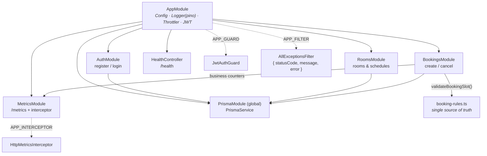
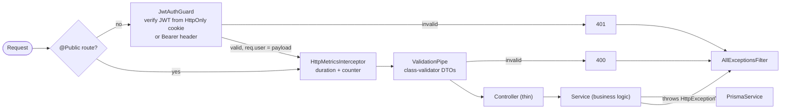
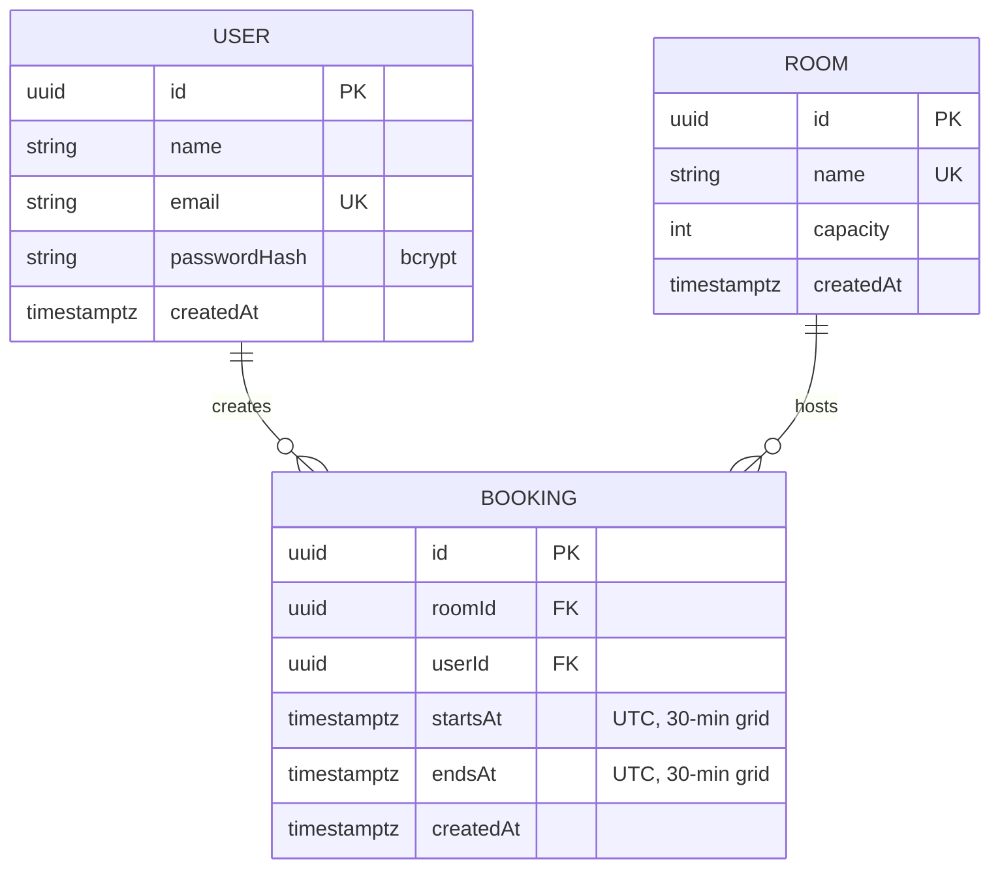
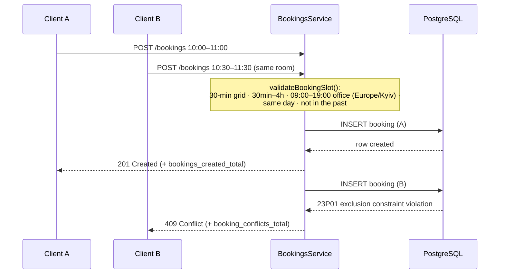

# Backend — NestJS REST API (Fastify adapter)

The booking API: JWT auth, rooms, bookings with database-level overlap
protection, Prometheus metrics and structured JSON logging. Runs on
`@nestjs/platform-fastify` (`FastifyAdapter({ trustProxy: true })` for real
client IPs behind Nginx) under the global `/api` prefix (except `GET /health`
and `GET /metrics`).

- Swagger UI: `GET /api/docs`
- Port: `3001` (env `PORT`)

## Module layout



## Request pipeline



`/auth/*` additionally passes `ThrottlerGuard` (10 req/min per IP by default;
real client IPs via the adapter's `trustProxy` behind Nginx).

**Session cookie.** Login/register set `token` (`HttpOnly; SameSite=Lax;
Path=/; Max-Age=86400` — matching the 24h JWT TTL); `POST /auth/logout`
clears it. Cookie parsing via `@fastify/cookie`. The Bearer header remains a
first-class alternative for Swagger/curl/tests. `COOKIE_SECURE=true` adds the
`Secure` attribute for TLS deployments.

## Data model



Plus (raw SQL migration `20260101000001_booking_no_overlap`):

- index `Booking(roomId, startsAt)`
- `EXCLUDE USING gist ("roomId" WITH =, tstzrange("startsAt","endsAt") WITH &&)`
  via `btree_gist` — overlap protection **in the database**, with touching
  boundaries allowed (half-open ranges `[start, end)`).

## Booking creation & the concurrency race



No pre-check `SELECT`: a single atomic `INSERT` either wins or loses, so of
two simultaneous requests exactly one succeeds by construction. All slot rules
live in one place — `src/app/bookings/booking-rules.ts` (pure, unit-tested).

Cancellation is a physical `DELETE`; only the author may cancel (`403`
otherwise), a concurrent double-delete degrades to `404`.

## Endpoints

| Method & path | Result |
| --- | --- |
| `POST /api/auth/register` | `201 { token, user }` + HttpOnly session cookie · `409` email taken |
| `POST /api/auth/login` | `200 { token, user }` + HttpOnly session cookie · `401` bad credentials |
| `POST /api/auth/logout` | `204`, clears the session cookie |
| `GET /api/rooms` | `200` rooms |
| `GET /api/rooms/:id/bookings?date=YYYY-MM-DD` | `200` day bookings with `isMine` · `400` bad date · `404` no room |
| `POST /api/bookings` | `201` · `400` rule violation · `404` no room · `409` overlap |
| `DELETE /api/bookings/:id` | `204` · `403` not owner · `404` not found |
| `GET /health` | `200 { status: "ok" }` (no prefix, no JWT) |
| `GET /metrics` | Prometheus text format (no prefix, no JWT) |

Every error has the shape `{ statusCode, message, error }` (global filter).

## Observability

- `http_request_duration_seconds` histogram + `http_requests_total` counter,
  labels `method` / `route` (Fastify route *pattern* from
  `request.routeOptions.url`, low cardinality) / `status` — recorded by an
  interceptor, so guard-rejected requests (401/429) are not counted
  (documented trade-off).
- Business counters: `bookings_created_total`, `bookings_cancelled_total`,
  `booking_conflicts_total`.
- Default Node.js process metrics.
- JSON request logs via `nestjs-pino` (`LOG_LEVEL` env; pretty in dev).
  `/health` and `/metrics` are excluded from request logging (nestjs-pino
  `exclude` — note: pino-http's `autoLogging.ignore` is not honored under the
  Fastify adapter, which is why the exclusion happens at middleware level).
- In Docker mode the container's stdout is shipped to **ELK**: Filebeat
  parses the pino JSON and indexes it into Elasticsearch; browse in Kibana
  (http://localhost:5601, data view `filebeat-*`, pre-provisioned).

## Time-zone handling

The office time zone is `Europe/Kyiv` (from `OFFICE_TIME_ZONE` in
`@office/shared`); all timestamps are stored and transported as UTC.
`src/app/time/office-time.ts` converts a `YYYY-MM-DD` day (interpreted in the
office zone) to a UTC range and checks working hours against office wall-clock
time — the frontend then renders those UTC instants in each viewer's own browser
zone. Grid alignment is checked against the UTC epoch (Europe/Kyiv is always a
whole-hour offset, so a 30-minute UTC grid matches the office grid).

## Running & testing

```bash
npx nx serve backend             # dev, needs `docker compose up -d db` + .env
npx nx build backend             # webpack bundle + pruned runtime package.json
npx nx test backend              # unit tests (Vitest + SWC for decorators)
npx nx run backend:test-integration  # supertest vs booking_test DB
npx nx run backend:seed          # idempotent demo data
```

The Docker entrypoint runs `prisma migrate deploy` → `node seed.js` →
`node main.js`. Config comes from env vars (`DATABASE_URL`, `JWT_SECRET`,
`JWT_TTL`, `THROTTLE_TTL_MS`, `THROTTLE_LIMIT`, `LOG_LEVEL`, `PORT`); see
`.env.example` in the repo root.
