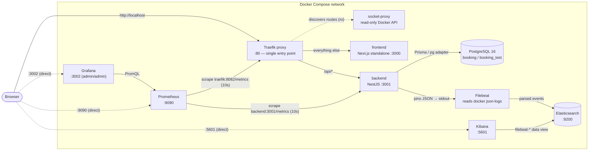
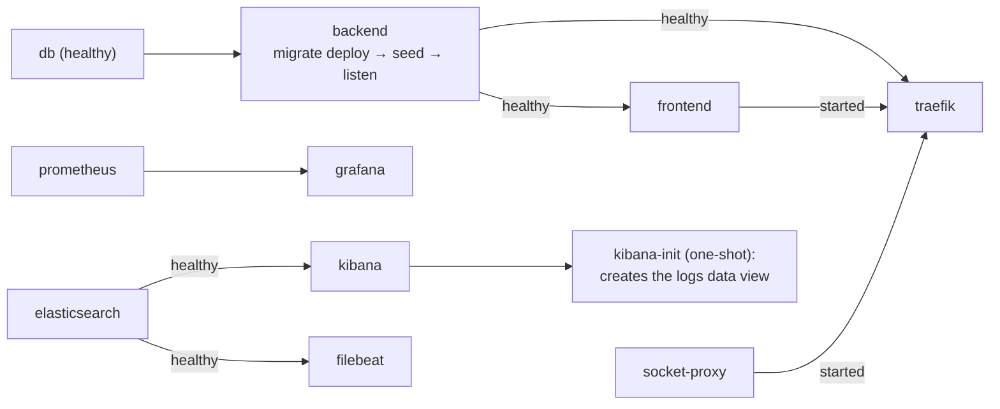
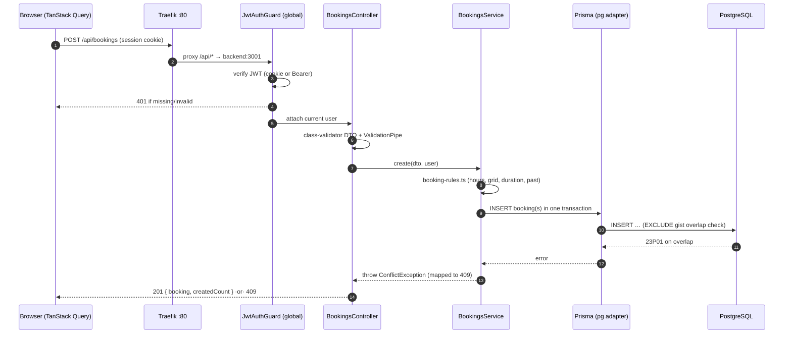
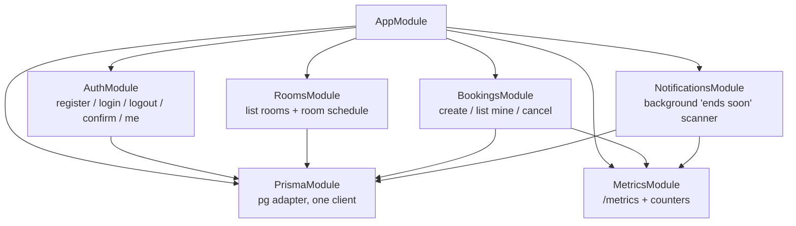
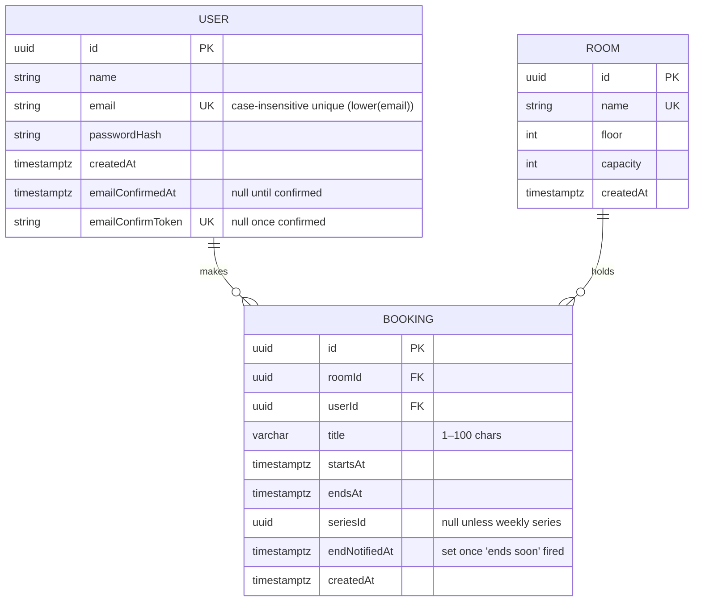

# Architecture

A high-level tour of how the system fits together: the runtime topology, the
request pipeline, the monorepo layout, the database schema, and the design
decisions worth knowing before you change anything.

- [System topology](#-system-topology)
- [Startup order](#-startup-order)
- [Request lifecycle](#-request-lifecycle)
- [Monorepo layout](#-monorepo-layout)
- [Backend architecture](#-backend-architecture)
- [Frontend architecture](#-frontend-architecture)
- [Shared contracts](#-shared-contracts-libsshared)
- [Database schema](#-database-schema)
- [Time-zone model](#-time-zone-model)
- [Cross-cutting concerns](#-cross-cutting-concerns)
- [Key decisions](#-key-decisions)

---

## 🗺️ System topology

Everything runs as a single Docker Compose project. **Traefik is the only entry
point** (`:80`); the frontend and backend ports are **not** published to the
host — all application traffic goes through the proxy. Prometheus, Grafana, and
Kibana publish their own ports directly for local tooling.



`GET /health` and `GET /metrics` are served **without** the `/api` prefix and
**without** JWT.

## 🔀 Startup order

Startup is enforced by health-gated `depends_on`, so nothing talks to a
dependency that isn't ready:



## 🔁 Request lifecycle

A typical authenticated write — creating a booking — from click to persistence:



Guards run **before** interceptors, which run around the handler, and the global
exception filter shapes every error into `{ statusCode, message, error }`.

## 📁 Monorepo layout

Nx **integrated** monorepo. TypeScript is `strict` everywhere; `any` is banned.

```
apps/
  backend/     NestJS REST API (+ prisma schema, migrations, seed, Dockerfile)
  frontend/    Next.js app (App Router, shadcn/ui, Dockerfile)
libs/
  shared/      Shared types, API DTO contracts, and domain constants
infra/
  traefik/     Reverse-proxy config (single entry point)
  prometheus/  Scrape config
  grafana/     Datasource + dashboard provisioning, dashboard JSON
  elk/         Filebeat config + Kibana data-view provisioning
  db/          init script creating the booking_test database
e2e/           Playwright browser tests
docker-compose.yml
```

`libs/shared` is the contract seam: both apps import the **same** DTO
interfaces and domain constants, so the API can't drift from the UI.

## ⚙️ Backend architecture

NestJS 11 on the **Fastify** adapter. Cross-cutting concerns are wired globally
in `app.module.ts`; feature logic lives in self-contained modules.

### Global providers (app-wide)

| Provider | Role |
| --- | --- |
| `JwtAuthGuard` (`APP_GUARD`) | Authenticates every route by default; opt out with `@Public()` |
| `AllExceptionsFilter` (`APP_FILTER`) | Normalizes all errors to `{ statusCode, message, error }` |
| `HttpMetricsInterceptor` | Records request duration/count + business counters |
| `ThrottlerModule` | Rate-limits `/auth/*` (`THROTTLE_TTL_MS` / `THROTTLE_LIMIT`) |
| `LoggerModule` (nestjs-pino) | Structured JSON request logs (excludes `/health`, `/metrics`) |
| `JwtModule` | Signs/verifies session tokens (`JWT_SECRET`, `JWT_TTL`) |

### Feature modules



- **`bookings/booking-rules.ts`** is the single home of the domain rules
  (working hours, 30-min grid, duration bounds, no-past, series expansion).
  It's pure and unit-tested (`booking-rules.spec.ts`).
- **`time/office-time.ts`** + `libs/shared` constants centralize the
  Europe/Kyiv ↔ UTC conversions (see [Time-zone model](#-time-zone-model)).
- **`prisma/prisma.service.ts`** owns a single Prisma client built on the `pg`
  driver adapter (Prisma 7 is engine-free — the connection is supplied at
  runtime, not from the schema).

## 🖥️ Frontend architecture

Next.js 16 **App Router**, React 19, client-fetched via **TanStack Query**.

### Routing & protection

```
src/app/
  (auth)/          login · register · confirm-email     ← anonymous-only
  (app)/           rooms · rooms/[id] · bookings         ← authenticated
  layout.tsx  providers.tsx  globals.css
src/middleware.ts  ← edge route protection
```

- **`src/middleware.ts`** runs before protected pages render: it redirects
  anonymous requests to `/login`, and logged-in visits to `/login`/`/register`
  back to `/`. It checks cookie presence and the JWT `exp` claim only —
  **signature verification stays on the backend** (the secret never leaves it),
  so a forged cookie still dies on the first API call with a 401. No client-side
  guard, no skeleton flash.
- **`lib/api.ts`** is the typed fetch client (uses the shared DTOs); a 401 clears
  the cached profile and redirects to `/login`.
- **`lib/schedule.ts`** / **`lib/timezone.ts`** build the week grid and convert
  UTC instants to the viewer's browser zone.
- The schedule is **live data**, refetched every 30 s; SSR is deliberately not
  used for it (it would add a backend round-trip per navigation for content
  that's immediately refetched anyway).

## 🔗 Shared contracts (`libs/shared`)

The wire format is defined once and imported by both sides:

- **`types.ts`** — every request/response DTO (`BookingDto`, `RoomDto`,
  `MyBookingDto`, `CreateBookingRequest`, `AuthResponseDto`, `ApiErrorResponse`,
  …). **All date-times cross the wire as ISO-8601 UTC strings.**
- **`constants.ts`** — domain constants: `OFFICE_TIME_ZONE`,
  `WORK_DAY_START_HOUR` (9), `WORK_DAY_END_HOUR` (19), `SLOT_MINUTES` (30),
  `MIN/MAX_BOOKING_MINUTES` (30 / 240), `MAX_REPEAT_WEEKS` (12),
  `MAX_TITLE_LENGTH` (100), password bounds.
- **`intervals.ts`** — overlap/interval helpers shared by rule checks and the UI.

## 🗄️ Database schema

PostgreSQL 16, three tables. UUID primary keys, `timestamptz(3)` timestamps.



### The keystone: no overlapping bookings

Overlap prevention is guaranteed **at the database level**, not in application
code, via a PostgreSQL exclusion constraint (raw-SQL migration, `btree_gist`):

```sql
EXCLUDE USING gist (
  "roomId"                              WITH =,
  tstzrange("startsAt", "endsAt")       WITH &&
)
```

- Ranges are **half-open**, so touching boundaries (`10:00–10:30` then
  `10:30–11:00`) are allowed.
- Under concurrency, exactly one of two competing inserts wins; the loser's
  `23P01` error is translated to **HTTP 409**. There is **no pre-check
  `SELECT`** — a single atomic `INSERT` is race-free by construction.

### Notable indexes & constraints

| Object | Purpose |
| --- | --- |
| `@@index([roomId, startsAt])` | Fast room-schedule range queries |
| `@@index([userId, startsAt])` | "My bookings" listing |
| `@@index([seriesId])` | Series cancellation (`scope=series`) |
| `@@index([endNotifiedAt, endsAt])` | The notification scanner's hot query |
| functional unique on `lower(email)` | Case-insensitive email uniqueness (raw-SQL migration) |
| `onDelete: Cascade` on `roomId`/`userId` | Bookings vanish with their room/user |

### Migrations

Timestamp-ordered under `apps/backend/prisma/migrations/` — `init`,
`booking_no_overlap` (the EXCLUDE constraint), `room_floor_booking_title`,
`recurring_and_notifications`, `email_confirmation`,
`email_case_insensitive_unique`. Applied with `migrate deploy` (Docker: on every
backend start; dev: `npm run prisma:migrate`).

## 🕒 Time-zone model

One of the most important design invariants:

| Concern | Rule |
| --- | --- |
| **Storage** | Always **UTC** (`timestamptz`) |
| **Validation** | Working hours (09:00–19:00) validated in **office time** (`Europe/Kyiv`) on the server |
| **Wire format** | ISO-8601 **UTC** strings |
| **Display** | Rendered in each **viewer's own browser time zone** |

So a `10:00` Kyiv slot appears as `09:00` to a Berlin visitor, while the server
still enforces office hours correctly. Weekly series repeat at the same
**office-zone wall-clock time**, which keeps them **DST-safe**.

## 🧩 Cross-cutting concerns

### Authentication

JWT stored in an **HttpOnly cookie** (`HttpOnly; SameSite=Lax; Path=/;
Max-Age=86400`) so JS never sees the token and XSS can't exfiltrate it;
`SameSite=Lax` doubles as CSRF protection. The guard also accepts a `Bearer`
header for Swagger/curl/tests. Set `COOKIE_SECURE=true` behind TLS.

### Email confirmation (dev-mode)

On registration a one-time token is generated and the confirmation link
(`APP_URL/confirm-email?token=…`) is written to the **server log** (no real
SMTP). Until confirmed, `POST /api/bookings` returns **403**. Seeded users are
pre-confirmed.

### "Ends soon" notifications

A dependency-free scheduler (`notifications.service.ts`) scans **every minute**
for bookings ending within `NOTIFY_BEFORE_MINUTES` **whose room's next slot is
taken**. It stamps `endNotifiedAt` so each booking notifies **exactly once**,
emits a log line, and increments `booking_end_notifications_total`. Delivery is
in-app (the header bell polls `GET /api/bookings/my/notifications`); the
log/metric channel makes swapping in email/push a one-method change.

### Metrics & logging

- **Metrics** (Prometheus): `http_request_duration_seconds` (histogram),
  `http_requests_total` (counter) with `method`/`route`/`status` labels, plus
  business counters `bookings_created_total`, `bookings_cancelled_total`,
  `booking_conflicts_total`, `booking_end_notifications_total`, and default
  Node.js process metrics.
- **Logs** (ELK, Docker): Filebeat tails docker json-file logs, parses the
  backend's pino JSON into event fields, and ships to Elasticsearch; Kibana's
  **Discover** (`filebeat-*`) is the UI.

## 🧭 Key decisions

A few choices worth knowing. Full rationale — context, alternatives, and
trade-offs — lives in the **[Decision Log](Decision-Log)** (ADRs); the original
app-level list is in the root
[`README.md`](../README.md#decisions-made-not-dictated-by-the-spec):

1. **JWT in an HttpOnly cookie** — XSS-safe, `SameSite=Lax` CSRF protection.
2. **Overlap enforced by the DB constraint only** — no pre-check, race-free.
3. **Fastify adapter** — exact status codes + route patterns for metrics.
4. **`bcryptjs`** — identical hash format, no native build in Alpine images.
5. **Client-side data fetching** (TanStack Query) for the live schedule; edge
   middleware handles route protection to avoid a skeleton flash.
6. **ELK without Logstash** — the app already emits JSON, so Filebeat's
   `decode_json_fields` is enough.

See also: **[Getting Started](Getting-Started)** · **[Code Style](Code-Style)**
