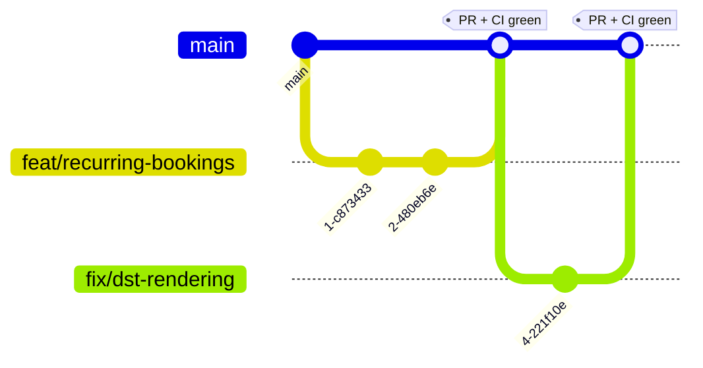

# Code Style

The conventions that keep this codebase consistent — formatting, TypeScript,
comments, commit messages, and branching. Most of it is **enforced
automatically** by Biome, git hooks, and CI, so you rarely have to think about
it; this page is the reference for the *why*.

- [Tooling](#-tooling-biome)
- [Formatting](#-formatting)
- [Linting & TypeScript](#-linting--typescript)
- [Comments](#-comments-explain-why-not-what)
- [Naming](#-naming)
- [Commit messages](#-commit-messages-conventional-commits)
- [Branching strategy](#-branching-strategy)
- [Git hooks](#-git-hooks)
- [Pull-request checklist](#-pull-request-checklist)

---

## 🛠️ Tooling: Biome

**[Biome](https://biomejs.dev)** is the single tool for both **formatting** and
**linting** (it replaced ESLint + Prettier). Config lives in `biome.json`.

```bash
npm run lint     # biome check .            → verify (lint + format), no writes
npm run format   # biome check --write .    → auto-fix lint + format in place
```

Editors: install the Biome extension and enable **format on save** — it uses the
project config, so local and CI results match exactly.

> ⚠️ The **backend rule overrides** in `biome.json` (`apps/backend/**`) are
> **load-bearing** — they accommodate NestJS decorator metadata and DI
> patterns. Don't remove them without understanding why (e.g.
> `useImportType: off` keeps runtime-needed imports for Nest's reflection).

## 🎨 Formatting

Enforced by Biome — never hand-format:

| Setting | Value |
| --- | --- |
| Indentation | **2 spaces** (no tabs) |
| Line width | **100** |
| Quotes | **single** (`'…'`) |
| Trailing commas | **all** |
| Semicolons | yes (Biome default) |

`*.css`, `apps/backend/prisma/migrations`, `infra/grafana/dashboards`, and the
usual build outputs (`dist`, `.next`, `coverage`, `.nx`) are excluded from
formatting.

## 🔒 Linting & TypeScript

Biome runs the **recommended** preset plus two project-wide upgrades to `error`:

| Rule | Level | Why |
| --- | --- | --- |
| `suspicious/noExplicitAny` | **error** | `any` is banned repo-wide — model the type instead |
| `correctness/noUnusedVariables` | **error** | Dead bindings don't reach `main` |

TypeScript is **`strict` everywhere** (`tsconfig.base.json`). Practical rules:

- **No `any`.** If a type is genuinely unknown, use `unknown` and narrow it.
- **Share the contract, don't redeclare it.** Cross-app request/response shapes
  live in `libs/shared` (`@office/shared`) — import them; never hand-copy a DTO.
- **Domain constants come from `libs/shared/constants.ts`** (working hours, slot
  size, limits) — don't inline magic numbers like `30` or `19`.
- **Dates on the wire are ISO-8601 UTC strings**; convert at the edges, keep UTC
  in the middle. (See [Architecture → Time-zone model](Architecture#-time-zone-model).)

## 💬 Comments: explain *why*, not *what*

This repo is **deliberately, heavily commented** — and that's intentional, not
clutter. The bar for a comment is simple:

> ✅ A comment should explain **why** the code is the way it is — a constraint, a
> trade-off, a non-obvious edge case, a "we do it this way because…".
> ❌ A comment should **not** restate **what** the next line already says.

```ts
// ✅ Good — captures a non-obvious reason
// Prisma 7 is engine-free: the connection is supplied by the pg driver adapter
// at runtime, so the URL no longer lives in the schema.

// ✅ Good — documents a boundary decision
// Ranges are half-open, so touching bookings (10:00–10:30 / 10:30–11:00) don't overlap.

// ❌ Noise — the code already says this
// increment the counter
counter++;
```

When cleaning up, **strip only the name-echoing comments** (the ones that just
repeat an identifier); **keep the explanatory ones**. The "why" comments are the
project's institutional memory.

## 🏷️ Naming

Follow the surrounding code; the prevailing conventions are:

| Kind | Convention | Example |
| --- | --- | --- |
| Files (backend) | `kebab-case.<role>.ts` (Nest style) | `bookings.service.ts`, `jwt-auth.guard.ts` |
| Files (frontend) | `kebab-case.tsx` | `notifications-bell.tsx` |
| Types / classes / components | `PascalCase` | `BookingDto`, `BookingsService` |
| Variables / functions | `camelCase` | `createBooking`, `startsAt` |
| Constants (domain) | `UPPER_SNAKE_CASE` | `WORK_DAY_START_HOUR`, `MAX_REPEAT_WEEKS` |
| DTO suffix | `…Dto` / `…Request` / `…Response` | `RoomDto`, `CreateBookingRequest` |

## 📝 Commit messages: Conventional Commits

Commit **subjects** must follow [Conventional Commits](https://www.conventionalcommits.org/).
This is enforced locally by the `commit-msg` hook and again in CI — both call the
**same** script, `scripts/lint-commit-msg.sh`, so they can never drift.

### Format

```
<type>(<optional scope>)<optional !>: <description>
```

- `<type>` — one of the allowed types below.
- `(<scope>)` — optional; lowercase, e.g. `(backend)`, `(bookings)`, `(deps)`.
- `!` — optional breaking-change marker.
- `<description>` — imperative mood, no trailing period.

### Allowed types

| Type | Use for |
| --- | --- |
| `feat` | A new feature |
| `fix` | A bug fix |
| `docs` | Documentation only |
| `style` | Formatting / whitespace (no logic change) |
| `refactor` | Code change that neither fixes a bug nor adds a feature |
| `perf` | Performance improvement |
| `test` | Adding or fixing tests |
| `build` | Build system or dependencies |
| `ci` | CI configuration / pipelines |
| `chore` | Maintenance that doesn't fit the above |
| `revert` | Reverting a previous commit |
| `release` | Release tagging (repo-specific; used for `release: v1.2.0`) |

> Git-generated subjects (`Merge …`, `Revert …`, `fixup!`, `squash!`, `amend!`)
> are accepted as-is, so merges and autosquash rebases don't get blocked.

### Examples

```text
feat(backend): add weekly recurring bookings
fix: correct Europe/Kyiv DST boundary in slot rendering
docs: document the .env variables
ci: enable the SonarQube quality gate
refactor(bookings): extract booking-rules into a pure module
feat(auth)!: require confirmed email before booking   # breaking change
release: v1.2.0
```

Bad — will be **rejected**:

```text
updated stuff              # no type
Fixed a bug.               # not a type; capitalized; trailing period
feature: add rooms         # 'feature' is not an allowed type (use 'feat')
```

## 🌳 Branching strategy

**Trunk-based (GitHub Flow).** `main` is the always-releasable trunk; work
happens on **short-lived branches** merged back via **pull request**, gated by
the full CI pipeline.



### Rules

- **Branch off `main`.** Keep branches small and short-lived; rebase on `main`
  rather than letting them drift.
- **Name branches `<type>/<short-kebab-description>`**, reusing the commit types
  — e.g. `feat/recurring-bookings`, `fix/dst-rendering`, `ci/rebalance-quality-gates`.
- **Open a pull request into `main`.** CI (below) must be green to merge.
- **`develop`** exists as an optional shared integration branch for teams who
  prefer to stage work before `main`; the release trunk is still `main`.
- Prefer **squash merges** so `main` keeps one clean Conventional-Commit subject
  per change.

### CI gates every PR

`.github/workflows/ci.yml` is the **DevSecOps pipeline** (ADR-0022; runs on every
push and PR). All source checks run **in parallel from t=0**, so a `--no-verify`
commit is still caught — every local hook check is re-run here.

| Group | Jobs |
| --- | --- |
| **Source checks** (parallel) | Lint (Biome) · Secrets (gitleaks) · Commit messages · SCA (Snyk) · Hadolint · IaC scan (Trivy) · License check · Unit tests + coverage · SAST (CodeQL) · Quality (SonarQube) · Integration |
| **Build → scan** | Build both images once (loaded, **not** pushed) → Container scan (Snyk, both images) |
| **E2E** | Playwright against the built stack |
| **Publish** (push to `main`/tags only) | Push to GHCR + SBOM & provenance attestations |

The images are built **once** and reused by the container scan and E2E; nothing is
published on a PR. External scanners **enforce** when their secret is set and
**fail** on a trusted run (push / same-repo PR) if it's missing — they skip cleanly
only on fork PRs.

## 🪝 Git hooks

Wired automatically on `npm install` (`prepare` → `git config core.hooksPath
.githooks`). They're fast (seconds) and only touch staged files:

| Hook | Does |
| --- | --- |
| **pre-commit** | Biome format + safe lint fixes on staged files (re-staged) · trailing-whitespace / conflict-marker check (`git diff --check`) · gitleaks secret scan (if installed) |
| **commit-msg** | Validates the subject via `scripts/lint-commit-msg.sh` |

Emergency bypass: `git commit --no-verify`. CI re-runs **every** one of these
checks, so nothing actually slips through.

## ✅ Pull-request checklist

Before you request review:

- [ ] `npm run lint` is clean (or `npm run format` applied).
- [ ] `npm test` passes; new logic has unit tests.
- [ ] Integration / e2e updated if the API or a user flow changed.
- [ ] No `any`; shared shapes imported from `libs/shared`, not re-declared.
- [ ] Comments explain **why**; no name-echoing noise.
- [ ] Commit subjects follow Conventional Commits.
- [ ] Docs updated (`README.md` / `/docs`) if behavior or setup changed.

See also: **[Getting Started](Getting-Started)** · **[Architecture](Architecture)**
