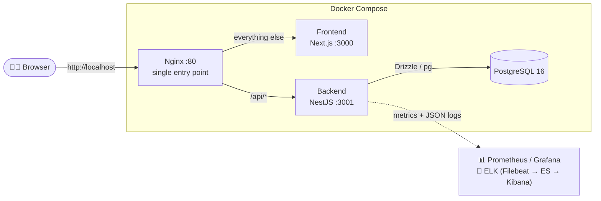

# Meeting Room Booking

> Book an office meeting room in a couple of clicks — see a room's week at a glance, grab a free slot, and manage your own bookings.


<!-- Enable once the repo slug is known — GitHub Actions live status badge:

-->

---

## 📖 What is this?

A meeting-room booking web application for an office. Employees open a room's
**week schedule**, see occupied slots, **book free time** with a titled meeting,
and **cancel their own** bookings. The **My bookings** page lists upcoming and
past bookings. Other people's bookings can never be modified or cancelled.

The office time zone is **Europe/Kyiv**; working hours are defined and validated
against it, but every time in the UI is rendered in the **visitor's own browser
time zone** — a `10:00` Kyiv slot shows as `09:00` for a Berlin visitor. Times
are stored in **UTC** in the database.

## ✨ Core features

| | Feature |
| --- | --- |
| 📅 | **Weekly room schedule** — 30-minute grid, 1–7 office days, live-refreshed every 30 s |
| ➕ | **Book a slot** — titled meeting, duration capped by the next booking / end of day / 4 h limit |
| 🔁 | **Recurring bookings** — repeat weekly (1–12 weeks) as an all-or-nothing series |
| 🗑️ | **Cancel your own** — "just this one" or "this and every later occurrence" |
| 🙋 | **My bookings** — upcoming (nearest first) and paginated past bookings |
| 🔔 | **"Ends soon" notifications** — in-app bell when your room is needed right after you |
| 🔐 | **JWT auth** — HttpOnly cookie session + email confirmation (dev-mode flow) |
| 🌓 | **Light / dark theme**, responsive, accessible UI (shadcn/ui + Radix) |
| 📊 | **Observability** — Prometheus metrics, pre-built Grafana dashboard, ELK logs |

## 🧱 Tech stack

| Layer | Technology |
| --- | --- |
| **Monorepo** | Nx (integrated), TypeScript `strict` everywhere, **no `any`** |
| **Frontend** | Next.js 16 (App Router), React 19, Tailwind CSS 4, shadcn/ui, lucide-react, sonner, next-themes, TanStack Query |
| **Backend** | NestJS 11 (Fastify adapter), class-validator DTOs, Swagger, JWT auth, `@nestjs/throttler` |
| **Database** | PostgreSQL 16 + Drizzle ORM (SQL migrations, `btree_gist` EXCLUDE constraint) |
| **Proxy** | Nginx — the single entry point (`:80`) |
| **Monitoring** | Prometheus + Grafana (pre-provisioned dashboard) |
| **Logging** | Structured JSON via `nestjs-pino` → ELK (Filebeat → Elasticsearch → Kibana) |
| **Tests** | Vitest (unit), supertest (integration), Playwright (e2e) |
| **Infra** | Docker + Docker Compose, multi-stage builds |
| **Quality** | Biome (lint + format), 5-stage DevSecOps CI (Snyk, SonarQube, CodeQL) |

## 🗺️ Architecture at a glance



> The full container topology, request pipeline, and database schema live in
> **[Architecture](Architecture)**.

## 🚀 Quick start

```bash
# Production-like, everything in Docker:
docker compose up --build
# → App at http://localhost
```

For hot-reload dev mode and the `.env` reference, see **[Getting Started](Getting-Started)**.

### Where things live once it's up

| Surface | URL | Notes |
| --- | --- | --- |
| **App** | http://localhost | via Nginx |
| **API (Swagger)** | http://localhost/api/docs | interactive REST docs |
| **Grafana** | http://localhost:3002 | `admin` / `admin`, dashboard pre-provisioned |
| **Prometheus** | http://localhost:9090 | scrapes `backend:3001/metrics` |
| **Kibana (logs)** | http://localhost:5601 | Discover → *Application logs* |

### Test accounts (seeded)

| Email | Password |
| --- | --- |
| `test1@office.dev` | `password123` |
| `test2@office.dev` | `password123` |

## 📚 Documentation index

| Page | What's inside |
| --- | --- |
| **[Getting Started](Getting-Started)** | Local setup, `.env` reference, running dev & Docker, tests |
| **[Architecture](Architecture)** | System topology, request flow, DB schema, module design, key decisions |
| **[Code Style](Code-Style)** | Biome config, TypeScript & comment conventions, Conventional Commits, branching |
| **[API Reference](API-Reference)** | REST endpoints, auth, request/response shapes, error format |
| **[Decision Log](Decision-Log)** | ADRs — key architecture & process decisions, with alternatives & trade-offs |

### In-repo references

- Root [`README.md`](../README.md) — the canonical, always-current project reference
- [`apps/backend/README.md`](../apps/backend/README.md) — backend deep dive
- [`apps/frontend/README.md`](../apps/frontend/README.md) — frontend deep dive

---

<sub>📄 License: MIT · This wiki is generated from the source in <code>/docs</code>.</sub>
